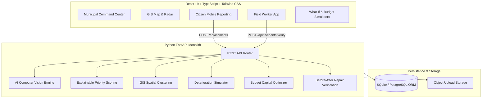

# 🏛️ CIVICVISION AI
### AI-Powered Public Infrastructure Intelligence & Predictive Maintenance Platform

> *"Don't wait for citizens to report a broken city. Let AI find where the city is breaking."*

CIVICVISION AI is an enterprise-grade, intelligent municipal command center that combines computer vision object detection, explainable priority scoring, GIS spatial hotspot clustering, predictive deterioration modeling, and AI before/after repair verification into a unified GovTech platform.

---

## 🌟 Core Differentiating Features

1. **Multi-Issue AI Vision Engine**: Analyzes uploaded road photos to detect and classify multiple simultaneous infrastructure anomalies (Potholes, Road Cracks, Water Accumulation, Overflowing Drains, Broken Streetlights) with bounding box overlays, confidence percentages, and estimated area ($m^2$).
2. **Explainable Priority Engine (0–100)**: Transparent priority scoring with a "Why this Priority?" modal breaking down Base Severity (+25), Traffic Corridor Stress (+20), Proximity to Schools/Hospitals (+20), Citizen Complaint Frequency (+15), Damage Footprint (+8), and Deterioration Trend (+6).
3. **GIS City Infrastructure Radar & Hotspots**: Interactive dark-mode GIS map with risk heatmaps, priority markers, and automatic DBSCAN-style spatial clustering into **Infrastructure Hotspots** (e.g., *HOTSPOT #01 - CRITICAL: 17 incidents within 500m*).
4. **Predictive Risk & What-If Simulator**: Interactive simulation engine modeling 30/60/90-day maintenance delays vs projected health recovery when top-priority sites are repaired.
5. **AI Maintenance Capital Budget Optimizer**: Recommends Pareto-optimal capital allocation strategies (Critical Arterials First, Maximum Radius Coverage, AI Hybrid ROI Optimal) given a target municipal budget ($50k–$250k).
6. **Human-in-the-Loop Second Opinion**: Allows municipal directors to override AI severity recommendations with full justification notes and audit tracking (`REVIEW REQUIRED`).
7. **AI Before/After Repair Verification**: Field worker uploads "After Repair" photo. The vision engine compares baseline pre-repair images against repaved surfaces to issue `REPAIR VERIFIED ✓` or `REPAIR VERIFICATION FAILED ✕`.

---

## 📐 System Architecture



---

## 👥 Role-Based Access Control (RBAC)

| Role | Access Level | Primary Features |
| :--- | :--- | :--- |
| **Citizen** | Public / Mobile | Submit photo/GPS defect reports, track report status, view public infrastructure health map |
| **Field Worker** | Mobile Web | View assigned work orders, GPS navigation links, upload before/after photos, trigger AI verification |
| **Municipal Officer** | Desktop Command Center | Review priority queue, human-in-the-loop severity override, assign work orders, run budget optimizer |
| **Admin** | Full Control | System metrics, user permissions, AI confidence thresholds, system audit logs |

*Note: Quick 1-click Role Switcher is available in the top navbar for hackathon reviewers.*

---

## 🛠️ Tech Stack

- **Frontend**: React 19, TypeScript, Vite, Tailwind CSS v4, Lucide Icons, Recharts, Leaflet / React-Leaflet
- **Backend**: Python 3.14, FastAPI, SQLAlchemy ORM, Pydantic v2, Pytest, Pillow, NumPy
- **Database**: SQLite (Zero-config local setup, PostGIS-ready schema)
- **Deployment**: Standalone API backend on port `8000`, Vite React UI on port `3000`

---

## 🚀 Local Setup & Quick Start

### 1. Clone & Prerequisites
Ensure Python 3.10+ and Node.js v18+ are installed.

```bash
cd civicvision-ai
```

### 2. Backend Setup & Test Suite

```bash
# Activate virtual environment
.\venv\Scripts\activate

# Run backend unit test suite (7/7 tests pass)
pytest backend/tests/test_api.py

# Start FastAPI Backend Server
python -m uvicorn main:app --app-dir backend --host 127.0.0.1 --port 8000
```

### 3. Frontend Setup

```bash
cd frontend
npm install
npm run dev -- --host 127.0.0.1 --port 3000
```

Open `http://localhost:3000` in your web browser.

---

## 🎯 3–5 Minute Hackathon Demo Workflow Guide

To experience the complete end-to-end incident lifecycle during a live presentation:

1. **Launch App**: Open `http://localhost:3000`. Click **"Demo Tour"** in the top navbar or select **Citizen** role.
2. **Submit Incident**: Click **"Report Issue"**. Select a sample photo (e.g. *Deep Pothole Crater*) or upload custom photo. Click **"Analyze Photo with AI Vision"**. Review detected bounding boxes and click **"Confirm & Submit Report"**.
3. **Inspect Priority Score**: Switch role to **Municipal Officer**. Go to **Command Center**. Locate your incident in the queue. Click **"Why Priority?"** to view the explainable factor breakdown (Score 94/100).
4. **Human-in-the-Loop Override**: Click **"Human Override"**. Change severity from `HIGH` to `MEDIUM` with justification notes.
5. **Explore GIS Radar & Hotspots**: View **HOTSPOT #01** on the GIS Radar map with 17 clustered defects within 500m.
6. **Run Predictive What-If & Budget Optimizer**: Click **"Run What-If Risk Simulator"** to adjust maintenance delay sliders (30/60/90 days). Click **"Budget Optimizer"** to simulate $50,000 capital allocation.
7. **Execute Repair & AI Verification**: Switch role to **Field Worker** via top navbar menu. Select assigned task. Upload an after-repair photo. Click **"Run AI Repair Verification"**. View `REPAIR VERIFIED ✓` (96.4% quality score match) and auto-resolution!

---

## 📄 License
Released under the MIT License for GovTech & Public Infrastructure Innovation.
